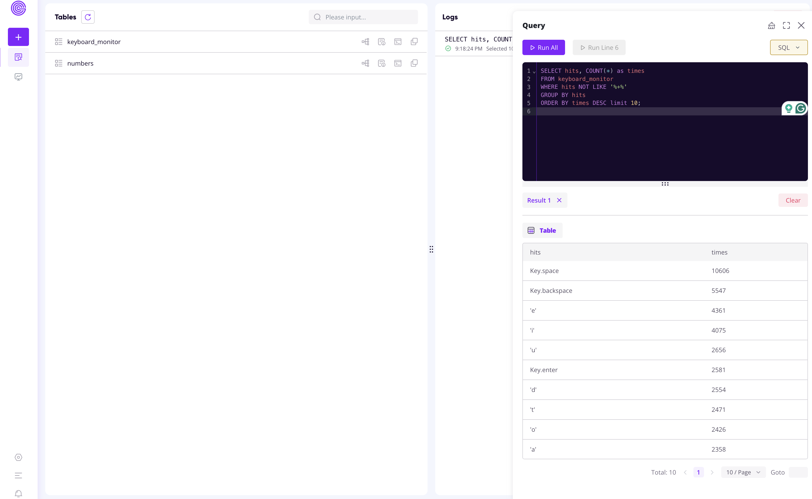
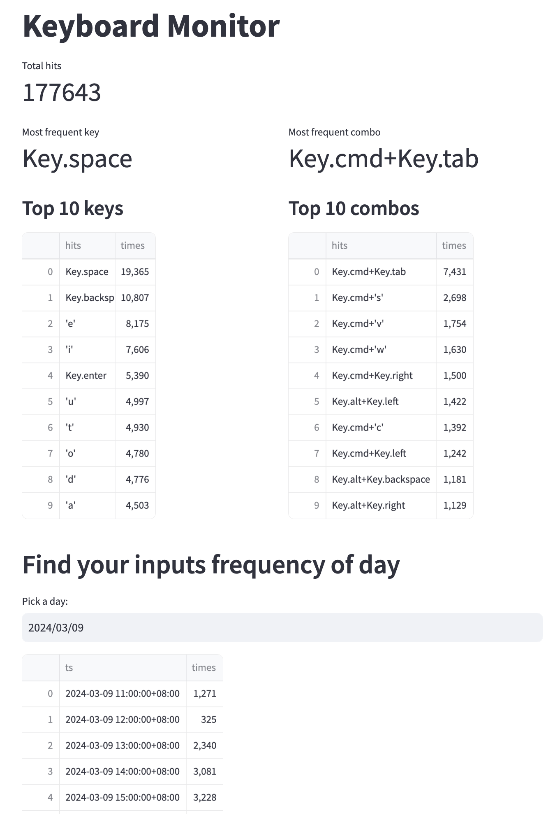

# Keyboard Monitor

原作者是用 GreptimeDB 的 MySQL + streamlit 实现的数据存储及展示，但是我在我自己的 Mac 上未能成功安装。

索性我就换了一种我觉得更轻量化的实现方式：SQLite + JSON + ChatGPT

为啥是 ChatGPT 呢，因为代码全部由 ChatGPT 生成，我只负责引导提示。


还没做展示，是因为不知道以什么方式展示比较好，我想接入到 Notion 中。如果你有好的建议，欢迎提 PR，有了 ChatGPT 之后，应该 PR 不是什么难事。

1. 收集按键信息
2. 分析按键信息： 
   1. 统计按键频率最高和最低的单键 
   2. 统计快捷键组合
   3. 按小时统计按键次数并进行时间段聚合
   4. 统计所有按键的预计消耗时间

```json
{
    "top_hits": [],
    "least_hits": [],
    "top_combinations": [],
    "least_combinations": [],
    "hourly_counts": [],
    "period_counts": {
        "Morning": 0,
        "Afternoon": 0,
        "Daytime": 0,
        "Evening": 0,
        "Night": 0,
        "Late Night": 0
    },
    "total_time_spent_sec": 0.0
}
```
原 GitHub 仓库：https://github.com/GreptimeTeam/demo-scene/tree/main/keyboard-monitor

## 以下是原 README

Read the blog ["Decoding your Daily Typing Habits: A Simple Tutorial on Keyboard Monitoring"](https://greptime.com/blogs/2024-03-19-keyboard-monitoring) for a full explanation.

### Prerequisites

* [Python 3](https://www.python.org/downloads/)

Other dependencies can be installed by:

```shell
pip3 install -r requirements.txt
```

### Step 1: Set up Greptime service

1. Obtain a free Greptime service from [GreptimeCloud](https://console.greptime.cloud/). 
2. Go to the "Connect" tab and find the connection string.
3. Copy `.env.example` to `.env` and set the connection string.


### Step 2: Start keyboard monitor

Run the agent script to listen to keyboard inputs:

```shell
python3 agent.py
```

You should see logs like:

```
2024-03-07 20:57:53,799 INFO listener_thread Listening...
2024-03-07 20:58:01,510 INFO sender_thread sent: Key.backspace
2024-03-07 20:58:01,947 INFO sender_thread sent: Key.enter
2024-03-07 20:58:02,498 INFO sender_thread sent: Key.shift+'#'
2024-03-07 20:58:02,938 INFO sender_thread sent: Key.space
2024-03-07 20:58:03,377 INFO sender_thread sent: Key.cmd+Key.right
2024-03-07 20:58:04,052 INFO sender_thread sent: Key.cmd+'s'
...
```

### Step 3: Query keyboard input statistics

The following sample queries are executed from the Web Dashboard.



#### Found the most frequent keys

```sql
SELECT hits, COUNT(*) as times
FROM keyboard_monitor
WHERE hits NOT LIKE '%+%'
GROUP BY hits
ORDER BY times DESC limit 10;
```

#### Found the most frequent combos

```sql
SELECT hits, COUNT(*) as times
FROM keyboard_monitor
WHERE hits LIKE '%+%'
GROUP BY hits
ORDER BY times DESC limit 10;
```

#### Calculate hits per minute

Read more about GreptimeDB's powerful [RANGE QUERY](https://docs.greptime.com/reference/sql/range).

```sql
SELECT
    ts,
    COUNT(1) RANGE '1h' as times
FROM keyboard_monitor ALIGN '1h'
ORDER BY ts DESC
LIMIT 10;
```

### Bonus: Visualization

It's easy to use [Streamlit](https://streamlit.io/) to display the input frequency.

Run the following script:

```shell
streamlit run display.py
```

It'll open a window in your browser and shows the data frames:



If the window is not opened, you can explicit view it via http://localhost:8501.
